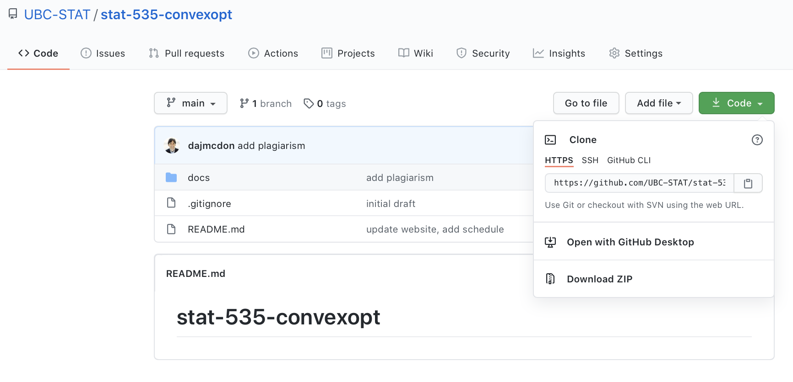

## Why version control?

.center[


]

* Much of this lecture is borrowed/stolen from Colin Rundel and Karl Broman

---

## Why version control?

* Simple formal system for tracking all changes to a project

* Time machine for your projects
    + Track blame and/or praise
    + Remove the fear of breaking things

* Learning curve is steep, but when you need it you REALLY need it

> Your closest collaborator is you six months ago, but you don’t reply to emails.
> -- _Paul Wilson_

---

## Why Git

* You could use something like Box or Dropbox

* These are poor-man's version control

* Git is much more appropriate

* It works with large groups

* It's very fast

* It's much better at fixing mistakes

* Tech companies use it (so it's in your interest to have some experience)

.emphasis[This will hurt, but what doesn't kill you, makes you stronger.]

---

## Overview

* `git` is a command line program that lives on your machine

* If you want to track changes in a directory, you type `git init`

* This creates a (hidden) directory called `.git`

* The `.git` directory contains a history of all changes made to "versioned" files

* This top directory is referred to as a "repository" or "repo"

* `github.com` is a service that hosts a repo  remotely and has other features: issues, project boards, pull requests, renders `.ipynb` & `.md`

* Some IDEs (pycharm, RStudio, VScode) have built in `git` (I don’t use this) 

* `git`/`github.com` is broad and complicated. Here, just what you **need**

---

## Typical workflow


.pull-left[
1. Download a repo from Github
```
git clone https://github.com/stat550-2021/lecture-slides.git
```
2. Create a **branch**
```
git branch <branchname>
```
3. Make changes to your files.
4. Add your changes to be tracked ("stage" them)
```
git add <name/of/tracked/file>
```
5. Commit your changes
```
git commit -m "Some explanatory message"
```


**Repeat 3--5 as needed. Once you're satisfied**

* Push to Github
```
git push
git push -u origin <branchname>
```
]

.pull-right[.center[

]]


---
## What should be tracked?

**Definitely** code, markdown documentation, tex files, bash scripts/makefiles, ...

**Possibly** logs, jupyter notebooks, images (that won’t change), ...

**Questionable** processed data, static pdfs, ...

**Definitely not** full data, continually updated pdfs (other things compiled from source code), ...

---

## What things to track


* You decide what is "versioned". 

* A file called `.gitignore` tells `git` files or types to never track

```
# History files
.Rhistory
.Rapp.history

# Session Data files
.RData

# User-specific files
.Ruserdata
```

* Shortcut to track everything (use carefully):

```
git add .
```


---

## Rules

**In-class work**
* Everyone shares a repo
* Each group/person makes a branch (with a creative name)
* Rename files that you clone.
* You push your changes and make a PR against `main`
* I review your work and merge the PR (I may ask for changes)

**Case Studies**
* Each team has its own repo
* [...] I'll come back to this
* You must make at **least 5 commits**
* Make a PR against `main` to submit
* I review your work and merge the PR (I may ask for changes)


---

## What's a PR?

* This exists on Github (not git)

* Demonstration

--

.pull-left[.center[

]]

.pull-right[.center[

]]

---

## Practice

.pull-left[

[Website](https://ubc-stat.github.io/stat-535-convexopt/)

Do you have `git`?
```
git --version
```
If it's there, you're done.

Help on `git/github`:

https://happygitwithr.com/install-git.html

]

.pull-right[.center[

]]


---
class: middle, inverse, center

## Useful formulae


---

## The `main/develop/branch` workflow

* When working on your own  
    1. Don't NEED branches.
    1. I often make a branch if I want to try a modification without breaking what I have.
    1. Otherwise, can "pretend `git` is Dropbox": work on `main`, make changes and commits, sync to remote for backup purposes.
    
--
    
* When working on a large team with production grade software
    1. `main` is protected, released version of software (maybe renamed to `release`)
    1. `develop` contains things not yet on `main`, but thoroughly tested
    1. On a schedule (once a week, once a month) `develop` gets merged to `main`
    1. You work on a `feature` branch off `develop` to build your new feature
    1. You do a PR against `develop` 
    
--

### Protection

* Typical for your PR to trigger tests to make sure you don't break things
* Typical for team members or supervisors to review your PR for compliance

.emphasis[Suggest you adopt the "production" version for your Team Assignments]


---

## Guardrails

* The `.github` directory contains interactions with Github

    1. Actions: On push/PR/other Github does something on their server (ex builds a website)
    1. PR templates: Little admonitions when you open a PR
    1. Branch protection: prevent you from doing stuff
    
* In this course (some Repos), I protect `main` so that you can't push there

.emphasis[
If you try to push to `main`, it will give an error like
```
remote: error: GH006: Protected branch update failed for refs/heads/main.
```
]

* I also use a PR template. It gives you some instructions that you should follow

--

.alert[Read the PR template!!]


---

## Operations in Rstudio 

1. Stage
1. Commit
1. Push
1. Pull
1. Create a branch

--

.emphasis[
Covers:
* Everything "on your own"
* Plus most other things you "want to do"
]

--

#### Command line versions

```
git add <name/of/file>
git commit -m "some useful message"
git push
git pull
git checkout -b <name/of/branch>

```

---

## Other useful, command line only

.pull-left[
.primary[Initializing]
```
git config user.name --global "Daniel J. McDonald"
git config user.email --global "daniel@stat.ubc.ca"
git config core.editor --global nano 
# or emacs or ... (default is vim)
```


.primary[Staging]
```
git add . # stage all
```

.primary[Committing]
```
# stage/commit simultaneously
git commit -am "message" 

# open editor to write long commit message
git commit 
```

.primary[Pushing]
```
# If <branchname> doesn't exist
# on remote, create it and push
git push -u origin <branchname>
```
]

.pull-right[
.primary[Branching]
```
# switch to <branchname>, error if uncommitted changes
git checkout <branchname> 
# switch to a previous commit
git checkout aec356

# create a new branch
git branch <branchname>

# create a new branch and check it out
git checkout -b <branchname>

# merge <branch2> onto <branch1>
git checkout <branch1>
git merge <branch2>

# grab a file from another branch
git checkout <branch2> -- name/of/file

git branch -v # list all branches
```

.primary[Check the status]
```
git status
git remote -v # list remotes
git log # show recent commits, msgs
```

]

---

## Some final pointers

* Commits have long names: `32b252c854c45d2f8dfda1076078eae8d5d7c81f`

* If you want to use it, you need "enough to be unique": `32b25`

* Online help uses directed graphs:
    * In stats, arrows point from cause to effect, forward in time
    * In git docs, it's reversed, they point to the thing on which they depend
    
* Reset/Revert/Rebase
    * These all appear to be "Undo"
    * But they are different
    * Documentation is a bit confusing

---

## How to undo

* Suppose we're concerned about a file named `README.md`
* Often, `git status` will give some of these as suggestions

1. Saved but staged
```
# grab the previously committed version
git checkout -- README.md 
```

2. Staged but not committed
```
# unstage
git reset HEAD README.md
git checkout -- README.md
```

3. Committed
```
# grab the version from another commit
git checkout 32b252 -- README.md
# grab the version from another branch
git checkout otherbranch -- README.md
```

---

## Recovering from things

1. Did work on main, got refused a Push
```
# make a new branch with everything, but stay on main
git branch newbranch
# find out where to go to
git log
# undo everything after ace2193
git reset --hard ace2193
git checkout newbranch
```

2. Made a branch, did lots of work, realized it all s**ks
```
git checkout main
git branch -d badbranch
```

3. Anything more complicated, either post to Slack or LMGTFY