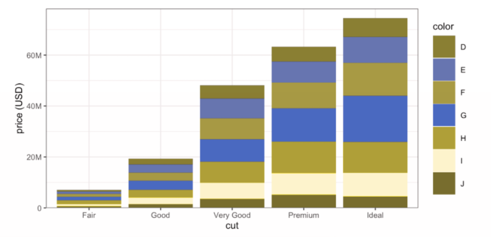

```{r setup, include=FALSE}
source("setup.R")
```

## Structure

1. Strategy (applies to papers too)

1. Dos and don'ts

1. Personal preferences


---
class: middle, center, inverse

# Strategy

---

## Genre

Talks take many forms (like papers)

* Department seminar

* Short conference presentation

* Class lecture

* `...`

Calibrate your talk to the .secondary[Genre] and the .secondary[Audience]

--

* A job talk takes much more work than a class presentation

* For context, after much practice, it takes me about 1 hour per minute of presentation length, depending on the amount of polish.

* My course lectures take about 4x the target duration.

* General ideas are the same for all styles.

---

## Audience

* Think about who you are talking to
    - Statisticians?
    - Students?
    - Potential employer?
    - People with PhD's but in other disciplines?
    - Your grandma?
    
* Regardless of the audience, I think of dividing the talk roughly in 3rds.

--

<hr>

1. Talk to your grandma. Why are you listening to me? Why is what I'm saying interesting?

2. Talk to your audience. What have I done that you should be able to do at the end?

3. Talk **slightly** over your audience. Why should you be impressed by me?

--

Part 3 is shorter depending on the Audience.


---

## Content 

Each part is a little mini-talk


1. Starts with the general idea

2. Develops a few details. .secondary[Strategy:] problem/solution or question/answer

3. Ends with a takeaway

--

But these parts are **recalibrated** to the audience.

* Your Grandma doesn't want to see math.
* Your employer might, but doesn't want to hear about $\sigma$-fields. 
* Statisticians don't want to see proofs (but might want a sketch).
* `...`

---

## Story structure

> Once upon a time, a young MSc student went into the woods of theory and found some trees. After three months of wandering, they saw a house...

--

> Axe-weilding woodsman saves student from wolf attack.

--

<hr>

1. (Enough details to give the headline.)

1. Headline result.

1. How do we know the result is real. What are the details of 
computation, inference, methodology.

1. Demonstration with empirics.

--

<hr>

Attention span diminishes quickly. 

What are the 3-5 takeaways?

Hit your main result at the beginning: this is what I can do that I couldn't before.

---

## The map

Map out what you've done.

* What did you find?

* What are the implications? Why does audience care?

* How do we do it?

--

Avoid wandering in the wilderness:

1. First we did this;
1. But that didn't work, so we tried ...
1. But then we added ...
1. Finally we got to the beach ...
1. And the water was nice ...

You left your audience somewhere in the wilderness.

---
class: middle, inverse, center

# Good resource

Prof. Trevor Campbell's ["How to Explain Things"](https://docs.google.com/presentation/d/13vwchlzQAZjjfiI3AiBC_kM-syI6GJKzbuZoLxgy1a4/edit?usp=sharing)

---
class: middle, center, inverse

# Dos and don'ts


---

## Words

.pull-left[
Too many words on a slide is bad

* Bullet points
* Too densely concentrated are bad
* Are bad
* Are hard to focus on

<br><br>

Empty space is your friend


]

.pull-right[
Lorem markdownum et moras et ponendi odores, neu magna per! Tyria meo iungitur
videt, frigore terras rogis Anienis poteram, dant. His vallem arma corpore
vident nunc nivibus [avus](http://mirantes.org/), dea. Spatium luce certa
cupiunt, lina. [Amabam](http://www.sub.com/satisego) opem, Iovis fecundaque et
parum.

Conplecti videndo altum et hunc Iovi fronte maris, cur Aiax, iam fata morsibus,
et. Aede virum annis audit modo: meus ramis videri: nec quod insidiisque Aonio
tenuem, AI. Trames Iason: nocent hortatus lacteus praebita
[paternos](http://ex.net/milledubitavit) petit, Paridis **aptus prius ut** origo
furiisque. Mercibus sis nullo aliudve Amathunta sufficit ululatibus,
praevalidusque segnis *et* Dryopen. Quem ipse tecum per causamque carinae fueram
medium usque suo parantem nostrum.

]

---

# Images

.pull-left[
Pictures are good

<br>

Flow charts are good.

<br>

.primary[Careful] use of .secondary[colour] is **good**.

<br>

### Size is good.

<br>

.hand[too much variation is distracting]
]

.pull-right[

]


--
.pull-right[
How long did you stare at the cat?
]


---
class: middle, center, inverse

# Personal preferences


---

## Graphics

```{r colours1, echo=FALSE, dev="png", fig.width=12, fig.height=6, fig.align='center'}
ggplot(diamonds, aes(cut,price, fill=color)) + 
  geom_col() +
  theme_grey() + 
  scale_fill_manual(values = scales::hue_pal()(n_distinct(diamonds$color)))
```

--

Defaults are almost always terrible.

---

## Issues with the preceding

* Colours are awful

* Grey background is distracting

* Text size is too small

* Legend position on the side is strange?

* Numbers on the y-axis are nonesense

* With barchart, y-axis should start at 0.

* `.png` vs `.svg`

---

## Graphics

```{r colours2, echo=FALSE, dev="png", fig.width=16, fig.height=8, fig.align='center'}
g <- ggplot(diamonds, aes(cut,price, fill=color)) + 
  geom_col() +
  theme_bw(24) + 
  ylab("price (USD)") +
  scale_y_continuous(labels = scales::label_number_si(),
                     expand = expansion(c(0,.05)))
g + scale_fill_viridis_d(guide = guide_legend(nrow=1)) +
  theme(legend.position = "bottom", 
        legend.key.width = unit(2, "cm"))
```

---

## Again

```{r colours3, echo=FALSE, dev="png", fig.width=16, fig.height=7, fig.align='center'}
g + scale_fill_brewer(palette = "Set1") +
  theme(legend.key.width = unit(2, "cm"),
        legend.key.height = unit(2, "cm"))
```

* I like this, but ~10% of men are colour blind (including some Stat faculty). 

---

## Simulation



---

## Jargon

* Be wary of acronyms (MLE, BLUP, RKHS)

* Again, think of your audience. MLE is fine for any statistician.

* Others need definitions in words and written on the slide

* Same for math notation $\overline{x},\ \mu,\ \sigma,\ \mathbf{UDV}^\top$

* And for applied work e.g. SNP

---
background-image: url("gfx/jargon.png")
background-position: center
background-size: contain


---

## Things I hate

`r con` Saying "I'm not going to talk about ..."  `r pro` "I'm happy to discuss ... later if you'd like".

`r con` Wiggling your laser pointer at every word. Highlight important things with pretty colours. Use pointer sparingly.

`r con` Playing with your collar, your pockets, your water bottle...

`r con` Staring at your slides ...

`r con` Displaying the total number of slides as in 6/85 in the lower right hand corner ...

`r con` Running over time. Skipping 6 slides to desperately make the time limit.

`r con` Using the default themes:

---
background-image: url("gfx/beamer-crud.png")
background-position: center
background-size: contain

---

## Never use tables of numbers

* Economists do this all the time for inexplicable reasons

* I rarely put these in papers either

* If I'm not going to talk about it, it doesn't go on the slide

* There's no way I'm going to read off the number, certainly not to 4 decimal places

* Use a graph

--

<hr>

A graph with 3 dots should be a table of 3 numbers.

But why do you have only 3 numbers?

Any table can be a better graph.

Is this the best way to display the data? Have I summarized too much?

---
background-image: url("gfx/ridge-boxplots.png")
background-position: center
background-size: contain


---

## Things you should do

`r pro` Number your slides

`r pro` Have lots of prepared backup slides (details, answers to potential questions, further analysis)

`r pro` Practice a lot. Practice in front of others. Practice the beginning more than the rest.

`r pro` BE EXCITED. You worked hard on this. All results are cool. Play them up. You did something good and you want to tell everyone about how awesome you are. Own it. 

`r pro` Take credit. Say "I showed this" not "It can be shown".

---

## Things that are debatable

* Math talks tend to be "chalkboard"

* CS talks tend to be "sales pitch"

* Stats is in the middle.

* I lean toward details with elements of salesmanship

* If I hear your talk, I want to be able to "do" what you created. This is hard without some math. 

* This also colours my decisions about software.


--

Jeff Bezos banned Powerpoint